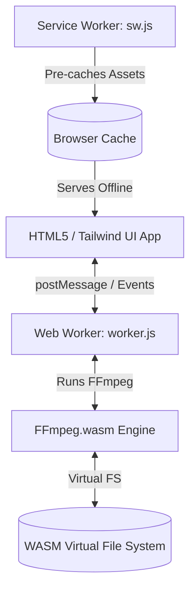

# 🎬 CharmeraTranscoder: Kodak Charmera AVI to MP4 Video Converter

Restore compatibility for your nostalgic Kodak Charmera videos. CharmeraTranscoder is a lightweight, high-performance, and **100% local** PWA video converter that converts raw M-JPEG/PCM AVI videos into modern, highly-compatible H.264/AAC MP4 videos directly in your browser.

**🔗 Live Demo (GitHub Pages):** [https://exonity1.github.io/avi2mp4/](https://exonity1.github.io/avi2mp4/)

---

## 🚀 How to Use

Since CharmeraTranscoder runs entirely in your web browser, using it is simple, secure, and requires no installations.

1. **Open the Web App**: Visit the [Live Demo](https://exonity1.github.io/avi2mp4/) or run the server locally.
2. **Select your Video**: Drag and drop your Kodak Charmera `.avi` file onto the upload card, or click the drop zone to open your local file browser.
3. **Choose a Preset**:
   * **Ultrafast (Default/Recommended)**: The fastest conversion speed, producing a slightly larger file size. Perfect for mobile or older machines.
   * **Fast**: A balanced option providing a standard compression ratio.
   * **Medium**: Slower encoding but produces the smallest file size with optimal quality.
4. **Convert**: Click the **"Convert to Compatible MP4"** button.
5. **Download & Preview**: Once the progress bar reaches 100%, you can preview the converted video directly in the web player and click **"Download Transcoded MP4"** to save it.

> [!IMPORTANT]
> **100% Private & Local:** Your videos are **never** uploaded to any external server. All processing is executed locally on your machine using WebAssembly.

---

## 🏗️ Architecture

CharmeraTranscoder is designed to be fully self-contained, offline-first, and highly performant on both mobile and desktop browsers.



### 1. WebAssembly Transcoding Engine (`ffmpeg.wasm`)
The core video processing relies on `ffmpeg.wasm`, a port of FFmpeg to WebAssembly. This allows the browser to run native-speed audio/video demuxing, decoding, encoding, and muxing.

### 2. Multi-threaded Background Processing (`Web Workers`)
Transcoding video is highly CPU-intensive. Running FFmpeg on the main browser thread would freeze the UI and degrade user experience. CharmeraTranscoder runs `ffmpeg.wasm` inside a background Web Worker (`worker.js`). All interactions between the UI (`app.js`) and the encoding engine happen asynchronously via `postMessage`.

### 3. Offline-First PWA (Service Worker)
The application functions entirely offline. A Service Worker (`sw.js`) caches all critical assets, styles, and the heavy WebAssembly binaries (`ffmpeg-core.wasm`, `ffmpeg-core.js`, and worker scripts) on initial load. Subsequent visits load instantly and work without internet connectivity.

### 4. Screen Wake Lock Integration
During conversion, especially on mobile devices, screens tend to auto-dim or sleep. If the tab goes to sleep, the browser throttles or terminates the WebAssembly thread. The app implements the modern **Screen Wake Lock API** to request active screen locks during transcoding, ensuring conversions complete successfully without user interruption.

---

## 📂 Codebase & Component Breakdown

Here is an explanation of the core files in this repository:

| File / Directory | Description |
| :--- | :--- |
| [`index.html`](file:///c:/Users/bjoer/Documents/antigravity/avi2mp4/index.html) | The primary user interface. Fully responsive, styled using Tailwind CSS, and optimized for mobile touch targets (minimum 48px elements). |
| [`app.js`](file:///c:/Users/bjoer/Documents/antigravity/avi2mp4/app.js) | Orchestrates the UI logic, state management, drag-and-drop actions, Wake Lock acquisitions, and establishes communication with the background worker. |
| [`worker.js`](file:///c:/Users/bjoer/Documents/antigravity/avi2mp4/worker.js) | The Web Worker thread. Initializes the FFmpeg WASM instance, coordinates the virtual WebAssembly filesystem, runs the encoding command, and posts real-time progress ratios back to the main thread. |
| [`sw.js`](file:///c:/Users/bjoer/Documents/antigravity/avi2mp4/sw.js) | The Service Worker. Contains pre-cache assets, cache-first network fallback strategy, and a custom MIME-type override mechanism to guarantee correct serving of `.wasm` and `.js` resources across various host systems. |
| [`server.py`](file:///c:/Users/bjoer/Documents/antigravity/avi2mp4/server.py) | A lightweight Python development server. Configures permissive CORS headers and forces correct MIME types (bypassing Windows Registry issues) to facilitate local testing of the multi-threaded WASM environment. |
| `ffmpeg/` | Localized directory housing `ffmpeg.min.js` wrapper and `ffmpeg-core` libraries, preventing external network dependence. |

---

## 🛠️ Local Development & Testing

Due to browser security requirements regarding Web Workers and WebAssembly (e.g., MIME types and isolation policies), opening `index.html` directly as a file (`file://`) will not work. You must serve the files via a local HTTP server.

1. **Ensure Python 3 is installed** on your system.
2. **Start the local server** by running:
   ```bash
   python server.py
   ```
3. **Access the application** at `http://localhost:8000`.

---

## ⚙️ How Transcoding Works (Under the Hood)

When you trigger a conversion, `worker.js` executes the following FFmpeg command on the virtual filesystem:

```bash
ffmpeg -i input.avi -c:v libx264 -crf 18 -preset [preset] -c:a aac -b:a 128k output.mp4
```

* **`-i input.avi`**: Specifies the input file written dynamically to the virtual memory filesystem.
* **`-c:v libx264`**: Encodes video using H.264, making it highly compatible with modern browsers, iOS, Android, and desktop players.
* **`-crf 18`**: Constant Rate Factor. A value of `18` represents visually lossless quality.
* **`-preset [preset]`**: Dictates the tradeoff between compression efficiency (file size) and CPU time. Configured via the UI.
* **`-c:a aac`**: Transcodes PCM audio into AAC (Advanced Audio Coding) for compatibility.
* **`-b:a 128k`**: Sets audio bitrate to 128 kbps.

### 🧹 Memory Management
To prevent running out of heap memory in the WebAssembly virtual machine, the input and output streams are unlinked immediately after transcoding completes and the array buffer is transferred back:
```javascript
ffmpeg.FS('unlink', 'input.avi');
ffmpeg.FS('unlink', 'output.mp4');
```
